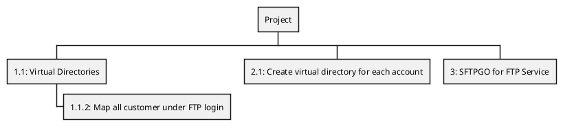
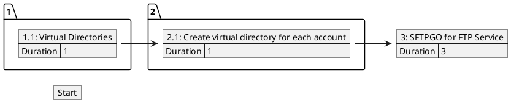

<!-- Code generated by gomarkdoc. DO NOT EDIT -->

# wbspert

Simple program to generate the following from a CSV:

+ PERT Chart (PlantUML)
+ Work Breakdown Structure (PlantUML)
+ Work Breakdown Table (Markdown)

The input spreadsheet is expected to look like this:

| Task | Title | Parents | Duration |
| --- | ---- | ------- | -------- |
| 1.1 | Virtual Directories | 1.1.2 | 1 |
| 1.1.2 | Map all customer under FTP login |  | 2 |
| 2.1 | Create virtual directory for each account | 1.1.2, 1.1 | 1 |
| 3 | SFTPGO for FTP Service | 2.1 | 3 |

This table would generate

**WBS**



**PERT**



## Usage

```
  wbspert [OPTIONS]

Application Options:
  -i=         The input file or - for stdin (default: -)
  -o=         The output file or - for stdout (default: -)
  -l=         The WBS level to use for PERT charts (default: 3)
  -w          Generate the WBS
  -p          Generate the PERT
  -t          Generate Markdown Table
  -e          Embed in an existing file

Help Options:
  -h, --help  Show this help message
```

### Embedding in an existing document

When embedding the diagrams the program will look for the following tags and place 
the diagram between them.  If they do not exist they will be added to the end of the 
document.

```
<!-- pert:embed:start -->
<!-- pert:embed:end -->

<!-- wbs:embed:start -->
<!-- wbs:embed:end -->

<!-- wbsTable:embed:start -->
<!-- wbsTable:embed:end -->
```