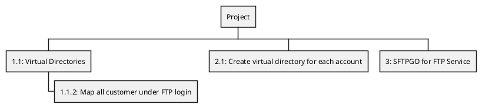
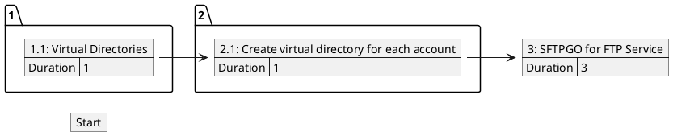

<!-- Code generated by gomarkdoc. DO NOT EDIT -->

# wbspert

Simple program to generate the following from a CSV:

+ PERT Chart (PlantUML)
+ Work Breakdown Structure (PlantUML)
+ Work Breakdown Table (Markdown)

The input spreadsheet is expected to look like this:

| Task | Title | Parents | Duration |
| --- | ---- | ------- | -------- |
| 1.1 | Virtual Directories | 1.1.2 | 1 |
| 1.1.2 | Map all customer under FTP login |  | 2 |
| 2.1 | Create virtual directory for each account | 1.1.2, 1.1 | 1 |
| 3 | SFTPGO for FTP Service | 2.1 | 3 |

This table would generate

**WBS**

**PERT**

